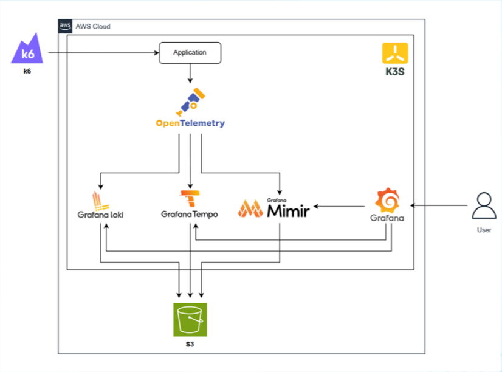

# 🔭 Kubernetes Observability & Performance Evaluation — LGTM Stack


---

## 📖 Project Overview

This project implements a **full-stack observability platform** on Kubernetes to benchmark and evaluate the performance of a microservice application (**Istio Bookinfo**) under various load conditions.

The system deploys the **LGTM Stack** (Loki, Grafana, Tempo, Mimir) alongside **OpenTelemetry** and **Prometheus** to collect **logs**, **traces**, and **metrics** — forming a complete observability pipeline. Performance is evaluated using **Grafana k6** with four distinct test scenarios: Baseline, RED Method, Stress, and Spike.

> **Course:** Performance Evaluation — University of Information Technology (UIT)

---

## 🏗️ Architecture



The system runs on a **K3s** cluster (with Traefik as the built-in Ingress controller) and uses **AWS S3** for long-term telemetry storage. For detailed architecture diagrams, see [📐 Architecture Diagrams](docs/architecture.md).

### Tech Stack

| Component | Tool | Role |
|---|---|---|
| **Cluster** | K3s | Lightweight Kubernetes distribution |
| **Ingress** | Traefik | Built-in K3s ingress + rate limiting middleware |
| **Application** | Istio Bookinfo | Target microservice workload (4 services) |
| **Autoscaling** | HPA (autoscaling/v2) | CPU-based horizontal pod autoscaling |
| **Logs** | Grafana Loki (SingleBinary) | Log aggregation, stored to S3 |
| **Traces** | Grafana Tempo | Distributed tracing backend, stored to S3 |
| **Metrics** | Grafana Mimir (Distributed) | Long-term Prometheus-compatible metrics storage |
| **Collector** | OpenTelemetry Collector | Unified telemetry pipeline (logs → Loki, traces → Tempo) |
| **Scraper** | Prometheus | Metrics scraping + remote_write to Mimir |
| **Visualization** | Grafana | Dashboards, alerting (Telegram), datasource integration |
| **Load Testing** | Grafana k6 | Performance benchmarking (4 scenarios) |
| **Storage** | AWS S3 | Object storage for Loki, Tempo, Mimir backends |

---

## 📂 Repository Structure

```text
k8s-observability-lgtm/
├── app/                              # Application workload manifests
│   ├── bookinfo.yaml                 # Bookinfo microservices (4 services) + OTel Instrumentation
│   ├── bookinfo-hpa.yaml             # HorizontalPodAutoscaler for all services
│   ├── ingress.yaml                  # Traefik IngressRoute
│   └── middleware.yaml               # Traefik rate-limiting middleware (75 in-flight)
│
├── monitoring/                       # Observability stack Helm values
│   ├── loki-values.yaml              # Loki SingleBinary mode, S3 backend
│   ├── tempo-values.yaml             # Tempo with S3 trace storage
│   ├── mimir-values.yaml             # Mimir distributed mode, S3 block storage
│   ├── otel-values.yaml              # OTel Collector: logs→Loki, traces→Tempo
│   ├── prometheus-values.yaml        # Prometheus with remote_write to Mimir
│   ├── grafana-values-public.yaml    # Grafana datasources + alerting config (sanitized)
│   └── grafana-features/             # Exported Grafana dashboard JSON models
│       ├── Infrastructure-*.json     # CPU/RAM/Pod Status dashboard
│       ├── RED Method-*.json         # Rate/Error/Duration dashboard
│       └── alert-rules-*.json        # Alert rule definitions
│
├── loadtest/                         # k6 load testing scenarios
│   ├── kb1_baseline.js               # Baseline: 10 VUs, 2min steady
│   ├── kb2_red.js                    # RED Method: ramp 10→100 VUs, measure R/E/D
│   ├── kb3_stress.js                 # Stress: step-load 100→800 VUs, find breaking point
│   └── kb4_spike.js                  # Spike: sudden surge 100→400 VUs (2 spikes)
│
├── docs/                             # Documentation & diagrams
│   ├── diagram.png                   # High-level architecture diagram
│   └── architecture.md               # Detailed Mermaid architecture diagrams
│
├── deploy.sh                         # One-click deployment script
└── .gitignore
```

---

## 🚀 Key Features

### Observability Pipeline
- **Logs**: Container logs collected via OTel Collector (filelog receiver) → forwarded to **Loki** via OTLP/HTTP
- **Traces**: Auto-instrumented via **OpenTelemetry Operator** (Java + Python) → collected by OTel Collector → exported to **Tempo** via OTLP/gRPC
- **Metrics**: Scraped by **Prometheus** (kube-state-metrics, node-exporter, app metrics) → remote_write to **Mimir** for long-term storage
- **Visualization**: **Grafana** with pre-provisioned datasources (Loki, Tempo, Mimir) and custom dashboards

### Application & Autoscaling
- **Bookinfo** microservice with 4 services: `productpage` (Python), `reviews` v1/v2/v3 (Java), `details` (Ruby), `ratings` (Node.js)
- **HPA** configured for all 6 deployments with CPU threshold at **60%**
- **Traefik Middleware** rate limiting: max **75 concurrent requests**

### Performance Benchmarking
- 4 distinct k6 test scenarios designed to evaluate system behavior under different load patterns
- Custom Grafana dashboards for **Infrastructure** (CPU/RAM/Pod Status) and **RED Method** (Rate/Errors/Duration)
- **Telegram alerting** integration for real-time notifications

---

## ⚙️ Quick Start

### Prerequisites
- A running K3s cluster (or any Kubernetes cluster)
- `kubectl` and `helm` CLI installed
- AWS credentials configured for S3 access (Loki/Tempo/Mimir backends)

### 1. Clone & Deploy

```bash
git clone https://github.com/hmdat-1706/k8s-observability-lgtm.git
cd k8s-observability-lgtm

# Make the script executable and run
chmod +x deploy.sh
./deploy.sh
```

The `deploy.sh` script automates the entire deployment:
1. Creates `bookinfo` and `lgtm` namespaces
2. Adds Helm repositories (Grafana, Prometheus Community, OpenTelemetry)
3. Deploys cert-manager + OpenTelemetry Operator
4. Deploys Bookinfo application with Ingress, Middleware, and HPA
5. Deploys LGTM stack: Loki → Tempo → Mimir → OTel Collector → Prometheus → Grafana

### 2. Verify

```bash
# Check workload pods
kubectl get pods -n bookinfo

# Check observability pods
kubectl get pods -n lgtm
```

### 3. Access Grafana

```bash
# Grafana is exposed via NodePort 30000
# Access at http://<NODE_IP>:30000
```

---

## 📊 Load Test Scenarios

All test scripts are in `loadtest/`. Update `TARGET_URL` in each script to match your cluster's Ingress IP before running.

| Scenario | File | VUs | Duration | Purpose |
|---|---|---|---|---|
| **Baseline** | `kb1_baseline.js` | 10 | 2 min | Establish normal metrics, no stress |
| **RED Method** | `kb2_red.js` | 10 → 100 | ~6 min | Measure Rate/Error/Duration under gradual load |
| **Stress Test** | `kb3_stress.js` | 100 → 800 | ~7.5 min | Find system breaking point (step-load) |
| **Spike Test** | `kb4_spike.js` | 100 → 400 × 2 | ~5 min | Test system recovery under sudden surges |

### Running Tests

```bash
# Install k6: https://grafana.com/docs/k6/latest/set-up/install-k6/

# Run baseline
k6 run loadtest/kb1_baseline.js

# Run stress test to find breaking point
k6 run loadtest/kb3_stress.js

# Run spike test to observe HPA + recovery behavior
k6 run loadtest/kb4_spike.js
```

---

## ⚠️ Known Limitations & Lessons Learned

### Resource Contention Issue

> **Critical Finding:** In this deployment, the application workload and the observability tools share the same cluster nodes without any isolation mechanism.

**Problem:**  
Both the `bookinfo` (application) and `lgtm` (monitoring) namespaces are scheduled onto the **same nodes**. During heavy load testing (e.g., Stress/Spike with 400–800 VUs), the application pods compete with observability components (Loki, Mimir, Tempo, OTel Collector, Prometheus) for CPU and memory. This creates a feedback loop:

1. Load test stresses the application → CPU/memory usage spikes on the node
2. Observability tools on the same node get starved → metrics collection degrades
3. Grafana dashboards show incomplete or delayed data → benchmark results become unreliable

**Impact on Results:**  
Performance measurements under high load may not accurately reflect the application's true behavior, as the observability overhead itself contributes to resource pressure.

### Proposed Solutions (Not Implemented)

The following strategies would resolve the contention issue in a production environment:

| Strategy | Implementation | Complexity |
|---|---|---|
| **Node Affinity** | Add `nodeSelector` or `nodeAffinity` to separate workload and tools onto different nodes | Low |
| **Taints & Tolerations** | Taint dedicated nodes for observability and add tolerations to LGTM pods | Medium |
| **Dedicated Node Pool** | Use separate node groups (e.g., AWS EKS managed node groups) for workload vs. monitoring | Medium |
| **Resource Quotas** | Apply `ResourceQuota` and `LimitRange` per namespace to cap resource consumption | Low |

```yaml
# Example: nodeSelector for workload isolation
# Add to bookinfo deployments:
spec:
  template:
    spec:
      nodeSelector:
        role: workload

# Add to LGTM deployments:
spec:
  template:
    spec:
      nodeSelector:
        role: monitoring
```

### Other Limitations
- **Hardcoded target URL** in k6 scripts — should be parameterized via environment variable
- **No persistent Grafana storage** — dashboard changes are lost on pod restart (mitigated by dashboardProviders in Helm values)
- **Single-replica components** — Loki, Tempo, and most Mimir components run with `replicas: 1` for cost efficiency, not suitable for production HA

---

## 📐 Diagrams

Detailed architecture and data flow diagrams are available in [`docs/architecture.md`](docs/architecture.md).

---

## 📄 License

This project was developed as a technical implementation for the **Performance Evaluation** course at the University of Information Technology (UIT).
