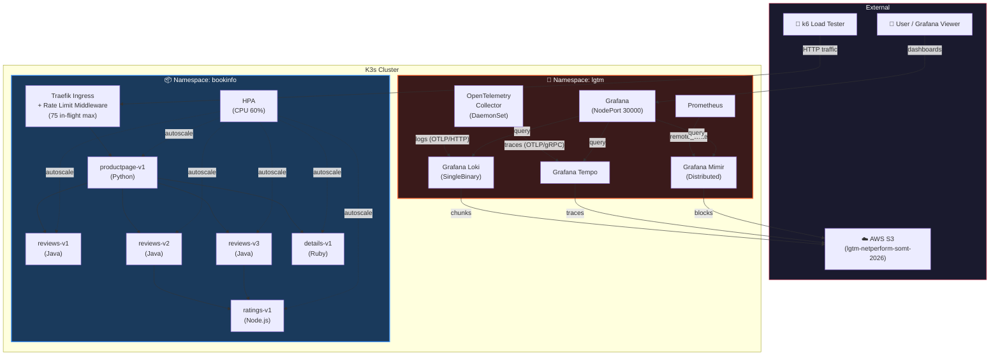
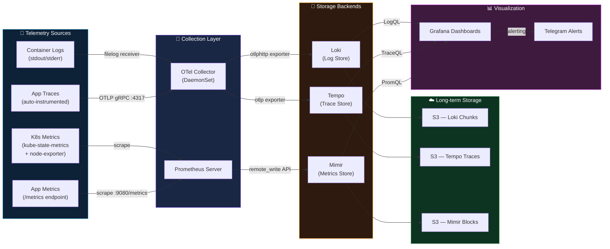
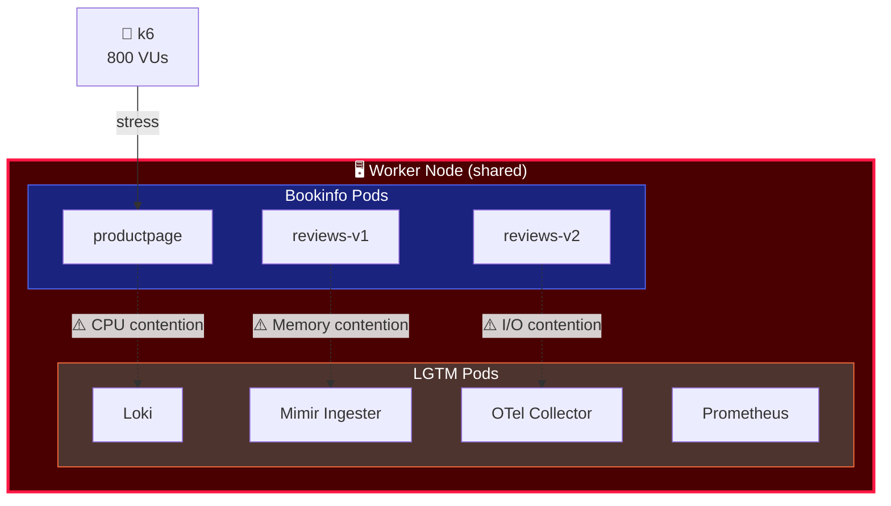
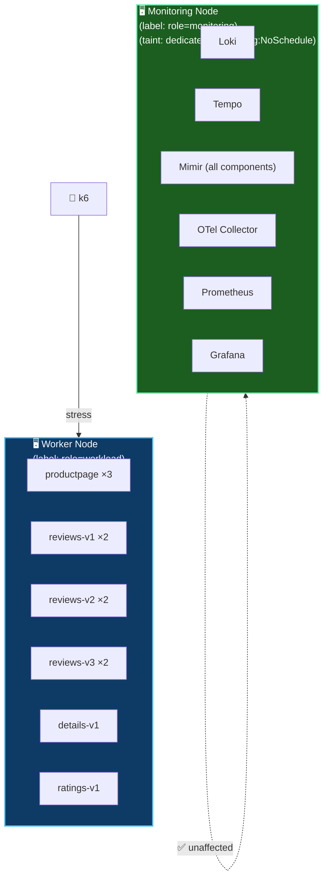
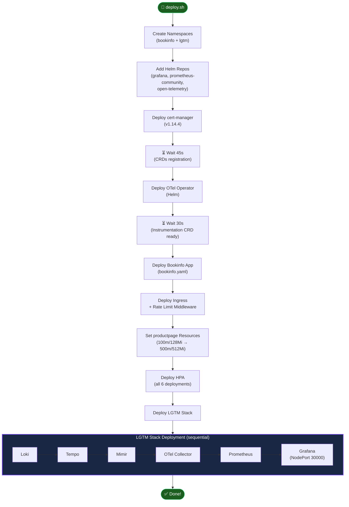

# 📐 Architecture Diagrams — LGTM Observability Stack

> All diagrams below are rendered as Mermaid and viewable directly on GitHub.

---

## 1. System Architecture Overview

High-level view of the entire system: K3s cluster with two namespaces, external load testing, and S3 storage.

---

## 2. Observability Data Flow Pipeline

Detailed view of how each telemetry signal flows through the system.

---

## 3. Resource Contention Problem — AS-IS vs TO-BE

This diagram illustrates the core issue that affects benchmark reliability.

### AS-IS: Current Deployment (No Isolation)

**Problem:** All pods land on the same node. Under heavy load, workload pods steal CPU/memory from observability tools → metrics become unreliable.

### TO-BE: Proposed Deployment (With Isolation)

**Solution:** Separate nodes using `nodeSelector` + `taints/tolerations`. Monitoring tools run on a dedicated node that workload pods cannot be scheduled on.

---

## 4. Load Test Scenarios — VU Traffic Patterns

Visual representation of the four k6 test scenarios and their virtual user (VU) ramp patterns.

```mermaid
gantt
    title k6 Load Test Scenarios — VU Ramp Patterns
    dateFormat X
    axisFormat %s sec

    section KB1 Baseline
    10 VUs steady          :b1, 0, 120

    section KB2 RED Method
    Ramp 0→10              :r1, 0, 10
    Hold 10                :r2, 10, 40
    Ramp 10→50             :r3, 40, 70
    Hold 50                :r4, 70, 100
    Ramp 50→100            :r5, 100, 145
    Hold 100               :r6, 145, 325
    Ramp 100→20            :r7, 325, 335
    Hold 20                :r8, 335, 395
    Cool-down              :r9, 395, 405

    section KB3 Stress
    Ramp to 100            :s1, 0, 60
    Ramp to 200            :s2, 60, 120
    Ramp to 300            :s3, 120, 180
    Ramp to 400            :s4, 180, 240
    Ramp to 500            :crit, s5, 240, 300
    Ramp to 600            :crit, s6, 300, 360
    Ramp to 800            :crit, s7, 360, 420
    Cool-down              :s8, 420, 450

    section KB4 Spike
    Warm-up 0→50           :sp1, 0, 30
    Baseline 100           :sp2, 30, 90
    SPIKE 1 → 400          :crit, sp3, 90, 100
    Hold spike             :crit, sp4, 100, 130
    Recovery → 100         :sp5, 130, 150
    Stable 100             :sp6, 150, 210
    SPIKE 2 → 400          :crit, sp7, 210, 220
    Hold spike             :crit, sp8, 220, 250
    Cool-down              :sp9, 250, 300
```

### Test Scenario Summary

| # | Scenario | Goal | Key Metrics | Pass Criteria |
|---|---|---|---|---|
| KB1 | **Baseline** | Establish normal operating metrics | RPS, latency P50 | All requests return 200 |
| KB2 | **RED Method** | Measure Rate, Errors, Duration under gradual load | R/E/D per service | Error rate < 1% |
| KB3 | **Stress** | Find system breaking point | RPS saturation, P95 latency | Error rate < 5%, P95 < 2s |
| KB4 | **Spike** | Test HPA reaction & system recovery | Scale-up time, recovery time | System recovers within 1 min |

---

## 5. Deployment Pipeline

The `deploy.sh` script executes the following steps in order:

### Deployment Notes
- Each Helm install includes a `sleep 10` between components to ensure readiness
- cert-manager requires a longer wait (45s) for CRD registration
- OTel Operator requires 30s for the `Instrumentation` CRD to be fully available
- Grafana is exposed via **NodePort 30000** for direct access

---

## 6. Namespace & Resource Layout

Overview of resource allocation across namespaces.

```mermaid
graph LR
    subgraph bookinfo["📦 bookinfo namespace"]
        direction TB
        PP["productpage-v1<br/>req: 100m/128Mi<br/>lim: 500m/512Mi<br/>HPA: 3–10 pods"]
        DT["details-v1<br/>req: 10m/64Mi<br/>lim: 100m/128Mi<br/>HPA: 1–5 pods"]
        RT["ratings-v1<br/>req: 10m/64Mi<br/>lim: 100m/128Mi<br/>HPA: 1–5 pods"]
        RV1["reviews-v1<br/>req: 50m/128Mi<br/>lim: 300m/300Mi<br/>HPA: 2–5 pods"]
        RV2["reviews-v2<br/>req: 100m/128Mi<br/>lim: 500m/512Mi<br/>HPA: 2–5 pods"]
        RV3["reviews-v3<br/>req: 100m/128Mi<br/>lim: 500m/512Mi<br/>HPA: 2–5 pods"]
    end

    subgraph lgtm["🔭 lgtm namespace"]
        direction TB
        LOK["Loki (1 replica)<br/>SingleBinary"]
        TMP["Tempo (1 replica)<br/>req: 50m/128Mi"]
        MIM["Mimir (7 components)<br/>distributor, ingester,<br/>querier, query-frontend,<br/>query-scheduler, compactor,<br/>store-gateway"]
        OTEL["OTel Collector<br/>(DaemonSet)"]
        PROM["Prometheus<br/>retention: 2h"]
        GRAF["Grafana<br/>NodePort 30000"]
    end

    bookinfo -.->|"⚠️ same nodes<br/>(no isolation)"| lgtm

    style bookinfo fill:#0d2137,stroke:#4fc3f7,stroke-width:2px,color:#fff
    style lgtm fill:#2e1a0e,stroke:#ff9800,stroke-width:2px,color:#fff
```

> **⚠️ Note:** Both namespaces are currently scheduled on the same nodes. See [Section 3](#3-resource-contention-problem--as-is-vs-to-be) for the proposed isolation strategy.
